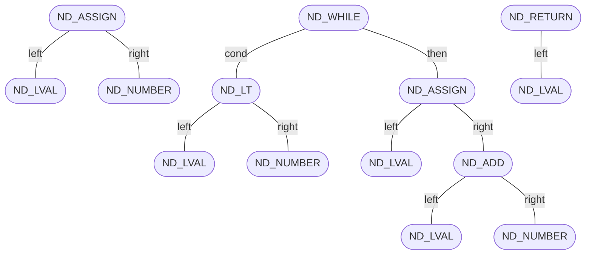

```mermaid
flowchart TD
0([ND_ASSIGN])
1([ND_LVAL])
0-- left ---1
3([ND_NUMBER])
0-- right ---3
100([ND_WHILE])
101([ND_LT])
102([ND_LVAL])
101-- left ---102
205([ND_NUMBER])
101-- right ---205
100-- cond ---101
203([ND_ASSIGN])
204([ND_LVAL])
203-- left ---204
409([ND_ADD])
410([ND_LVAL])
409-- left ---410
821([ND_NUMBER])
409-- right ---821
203-- right ---409
100-- then ---203
200([ND_RETURN])
201([ND_LVAL])
200-- left ---201
```
